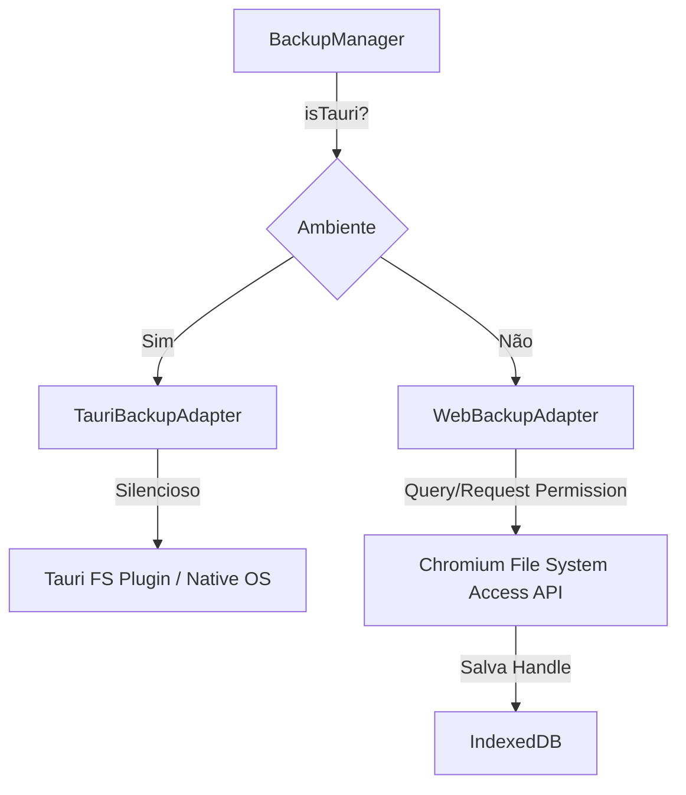

# Pesquisa e Boas Práticas: File System Access API vs Tauri FS API para Sistema de Backup Silencioso

**Data:** 11 de Setembro de 2026  
**Projeto:** Editor Taurus  
**Objetivo:** Estabelecer arquitetura robusta para backup local de documentos tanto no navegador Web (Chromium PWA via File System Access API) quanto na aplicação Desktop nativa (Tauri v2).

---

## 1. Resumo Executivo

O Editor Taurus necessita de um mecanismo confiável para realizar **backups automáticos e silenciosos** dos documentos do usuário em uma pasta local selecionada (ex: `C:\Users\Estoque_Original\Desktop\bkp editor`).

Entretanto, as regras de segurança diferem drasticamente entre os dois ambientes de execução:
1. **Navegadores Chromium (Web/PWA):** A `File System Access API` permite escolher pastas e salvar arquivos, e os handles (`FileSystemDirectoryHandle`) podem ser persistidos no `IndexedDB`. Porém, devido às políticas de segurança da Web, a reativação de permissões de escrita após a reinicialização da sessão exige uma **interação do usuário** (*user gesture*).
2. **Ambiente Tauri v2 (Desktop):** Possui acesso direto ao sistema de arquivos nativo do SO via plugin `@tauri-apps/plugin-fs` ou comandos Rust (`std::fs`). Permite **gravação 100% silenciosa e em segundo plano** em qualquer caminho de pasta pré-configurado ou escolhido pelo usuário, sem necessidade de re-solicitar permissões a cada sessão.

Para suportar ambos os cenários com máxima elegância, é recomendada uma **Arquitetura de Adaptador Duplo (Dual-Adapter Pattern)**.

---

## 2. File System Access API no Chromium (Web / PWA)

### 2.1 Fluxo de Seleção e Obtenção do Handle
No Chromium (Chrome, Edge, Opera, Brave), a API expõe a função global `window.showDirectoryPicker()`.

```javascript
// Exemplo de seleção de diretório no navegador
async function selectBackupFolder() {
  try {
    const directoryHandle = await window.showDirectoryPicker({
      mode: 'readwrite',
      startIn: 'desktop'
    });
    return directoryHandle;
  } catch (err) {
    if (err.name === 'AbortError') {
      console.log('Usuário cancelou a seleção de pasta.');
    } else {
      console.error('Erro ao selecionar pasta:', err);
    }
    return null;
  }
}
```

### 2.2 Persistência no IndexedDB
Os objetos `FileSystemDirectoryHandle` e `FileSystemFileHandle` implementam a especificação *Structured Clone Algorithm*. Isso significa que eles **podem ser salvos e recuperados diretamente no IndexedDB**.

```javascript
// Salvando o Handle no IndexedDB
import { openDB } from './db.js';

export async function saveBackupHandle(handle) {
  const db = await openDB();
  const tx = db.transaction('settings', 'readwrite');
  const store = tx.objectStore('settings');
  await store.put({ id: 'backup_dir_handle', handle, updatedAt: new Date().toISOString() });
}

// Recuperando o Handle do IndexedDB
export async function getBackupHandle() {
  const db = await openDB();
  const tx = db.transaction('settings', 'readonly');
  const store = tx.objectStore('settings');
  const record = await store.get('backup_dir_handle');
  return record ? record.handle : null;
}
```

### 2.3 Gestão de Permissões (`queryPermission` e `requestPermission`)
Embora o `FileSystemDirectoryHandle` permaneça salvo no IndexedDB, **a permissão de acesso (leitura/escrita) expira quando a aba ou o navegador é fechado**.

*   `handle.queryPermission({ mode: 'readwrite' })`: Verifica o estado atual (`'granted'`, `'prompt'`, `'denied'`).
*   `handle.requestPermission({ mode: 'readwrite' })`: Solicita a permissão ao usuário.

> [!IMPORTANT]
> **Regra do Chromium (User Gesture Requirement):**  
> `handle.requestPermission()` **DEVE** ser chamado obrigatoriamente a partir de uma ação direta do usuário (ex: clique em botão). Se chamado silenciosamente na inicialização da aplicação (sem *user gesture*), o navegador lançará uma exceção `DOMException: NotAllowedError` ou desconsiderará a requisição.

#### Padrão de Verificação e Reativação de Permissão Web:
```javascript
export async function verifyOrRequestPermission(fileHandle, readWrite = true) {
  const options = { mode: readWrite ? 'readwrite' : 'read' };
  
  // 1. Verifica estado atual da permissão
  if ((await fileHandle.queryPermission(options)) === 'granted') {
    return true;
  }

  // 2. Se for 'prompt', solicita permissão (PRECISA ser dentro de um handler de clique)
  if ((await fileHandle.requestPermission(options)) === 'granted') {
    return true;
  }

  return false;
}
```

---

## 3. Integração com Tauri v2 FS API (Desktop)

No ambiente Tauri v2, a aplicação roda nativamente no sistema operacional. Não há limitações de *user gesture* ou expiração de token de permissão de sessão da Web.

### 3.1 Vantagens no Tauri
*   **Gravação Silenciosa:** Salva arquivos automaticamente em segundo plano (em salvar arquivo, auto-save ou temporizador).
*   **Caminhos Estáticos/Fixos:** Pode gravar diretamente em diretórios fixos como `C:\Users\Estoque_Original\Desktop\bkp editor` ou subpastas em `AppData`/`Documents`.
*   **Zero Diálogos Repetitivos:** O usuário define a pasta uma única vez nas configurações e o app grava indefinidamente.

### 3.2 Configuração de Permissões no Tauri v2 (`capabilities`)
No Tauri v2, a segurança do sistema de arquivos é configurada através do arquivo de permissões (`src-tauri/capabilities/default.json` ou similar).

#### Exemplo de configuração de escopo e capacidades:
```json
{
  "$schema": "../gen/schemas/desktop-schema.json",
  "identifier": "default",
  "description": "Capacidades padrão da aplicação",
  "windows": ["main"],
  "permissions": [
    "core:default",
    "fs:allow-app-write",
    "fs:allow-exists",
    "fs:allow-mkdir",
    "fs:allow-write-file",
    "fs:allow-read-file",
    "fs:allow-remove",
    {
      "identifier": "fs:scope",
      "allow": [
        "$DESKTOP/bkp editor/**",
        "$DOCUMENT/**",
        "$APPDATA/**"
      ]
    }
  ]
}
```

### 3.3 Uso da API JS (`@tauri-apps/plugin-fs`)

```javascript
import { writeTextFile, mkdir, exists, BaseDirectory } from '@tauri-apps/plugin-fs';

export async function tauriSaveBackupSilently(targetFolderPath, fileName, content) {
  try {
    // Garante que a pasta de destino existe
    const folderExists = await exists(targetFolderPath);
    if (!folderExists) {
      await mkdir(targetFolderPath, { recursive: true });
    }

    const fullPath = `${targetFolderPath}/${fileName}`;
    await writeTextFile(fullPath, content);
    console.log(`[Tauri Backup] Backup salvo silenciosamente em: ${fullPath}`);
    return true;
  } catch (err) {
    console.error('[Tauri Backup] Falha ao gravar backup:', err);
    throw err;
  }
}
```

---

## 4. Estratégia de Gravação Atômica (Safe Atomic Writes)

Para evitar corrupção de arquivos em eventuais travamentos do app, quedas de energia ou interrupções no salvamento, tanto na Web quanto no Desktop deve-se aplicar o padrão de **Escrita Atômica**:

1. Escrever os dados em um arquivo temporário com sufixo `.tmp` (ex: `documento_123.json.tmp`).
2. Sincronizar o arquivo no disco.
3. Renomear/substituir o arquivo temporário para o nome final (`documento_123.json`).

### Implementação Atômica no Chromium (File System Access API):
```javascript
async function safeWriteWeb(dirHandle, fileName, data) {
  // Criar ou sobrescrever arquivo temporário
  const tempFileHandle = await dirHandle.getFileHandle(`${fileName}.tmp`, { create: true });
  const writable = await tempFileHandle.createWritable();
  await writable.write(data);
  await writable.close(); // Garante flush no disco

  // Movimentar/renomear arquivo no diretório (Chromium 110+)
  if (tempFileHandle.move) {
    await tempFileHandle.move(fileName);
  } else {
    // Fallback para navegadores sem move()
    const targetFileHandle = await dirHandle.getFileHandle(fileName, { create: true });
    const targetWritable = await targetFileHandle.createWritable();
    await targetWritable.write(data);
    await targetWritable.close();
    await dirHandle.removeEntry(`${fileName}.tmp`);
  }
}
```

---

## 5. Arquitetura Unificada (Pattern Dual-Adapter)

Para isolar o código de interface das particularidades do ambiente, o Editor Taurus utilizará um gerenciador unificado com detecção dinâmica de ambiente.



### Código do BackupManager Unificado (`js/backup/BackupManager.js`)

```javascript
import { saveDoc, getDoc } from '../db.js';

// Detecção do ambiente Tauri
export function isTauriEnvironment() {
  return typeof window !== 'undefined' && (window.__TAURI_INTERNALS__ !== undefined || window.__TAURI__ !== undefined);
}

export class BackupManager {
  constructor() {
    this.adapter = null;
  }

  async init() {
    if (isTauriEnvironment()) {
      const { TauriBackupAdapter } = await import('./TauriBackupAdapter.js');
      this.adapter = new TauriBackupAdapter();
    } else {
      const { WebBackupAdapter } = await import('./WebBackupAdapter.js');
      this.adapter = new WebBackupAdapter();
    }
    await this.adapter.init();
  }

  async selectDirectory() {
    return await this.adapter.selectDirectory();
  }

  async isReady() {
    return await this.adapter.isReady();
  }

  async requestPermissionIfNeeded() {
    return await this.adapter.requestPermission();
  }

  async backupDocument(document) {
    if (!(await this.isReady())) {
      console.warn('[Backup] Pasta de destino não configurada ou sem permissão.');
      return false;
    }

    const fileName = `bkp_${document.id}_${Date.now()}.json`;
    const payload = JSON.stringify(document, null, 2);

    return await this.adapter.writeBackup(fileName, payload);
  }
}
```

---

## 6. Matriz Comparativa

| Funcionalidade | File System Access API (Web/Chromium) | Tauri FS API (Desktop) |
| :--- | :--- | :--- |
| **Persistência de Seleção** | Sim (Handle salvo no IndexedDB) | Sim (Caminho String salvo em LocalStorage/DB) |
| **Gravação Silenciosa** | Sim (apenas enquanto a sessão durar) | **Sim (100% silencioso e perpétuo)** |
| **Re-solicitação de Permissão** | **Exige interação do usuário (*user gesture*) após reiniciar navegador** | **Não exige nada**. Acesso automático continuo |
| **Caminhos Nativos Fixos** | Apenas via Seletor do Usuário (`showDirectoryPicker`) | Qualquer caminho nativo (`C:\Users\...\Desktop\bkp editor`) |
| **Compatibilidade** | Chrome, Edge, Opera, Brave (Incompatível com Firefox/Safari) | Windows, macOS, Linux (App Desktop) |

---

## 7. Recomendações de Implementação no Editor Taurus

1. **Priorizar UX Adaptativa:**
   - No **Tauri**, permitir definir um caminho padrão (ex: `C:\Users\Estoque_Original\Desktop\bkp editor`) nas configurações que inicia automaticamente o backup silencioso.
   - Na **Web**, exibir um indicador na barra de status (ex: `[Backup Ativo]` ou `[Re-conectar Pasta]`). Se a permissão expirar, o botão exibirá um badge amarelo solicitando um clique rápido para reativar.
2. **Rotação de Backups:**
   - Manter um limite de histórico de arquivos por documento (ex: últimos 5 backups) removendo os arquivos mais antigos via `removeEntry` (Web) ou `remove` (Tauri).
3. **Persistência e Tolerância a Falhas:**
   - Sempre executar escritas atômicas (`.tmp` + `rename`).
   - Manter o IndexedDB como primeira camada de armazenamento offline da aplicação, utilizando o backup em pasta local como cópia redundante de segurança.
